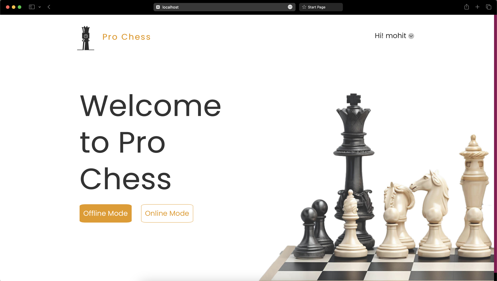
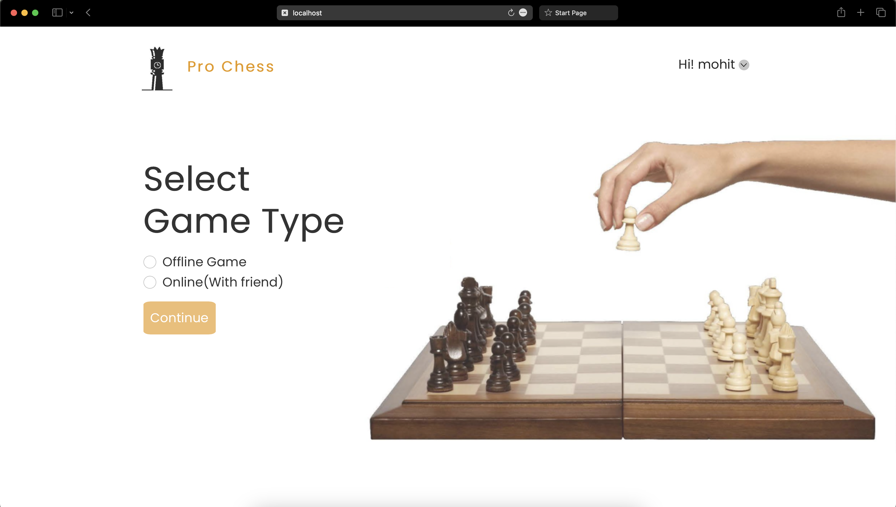
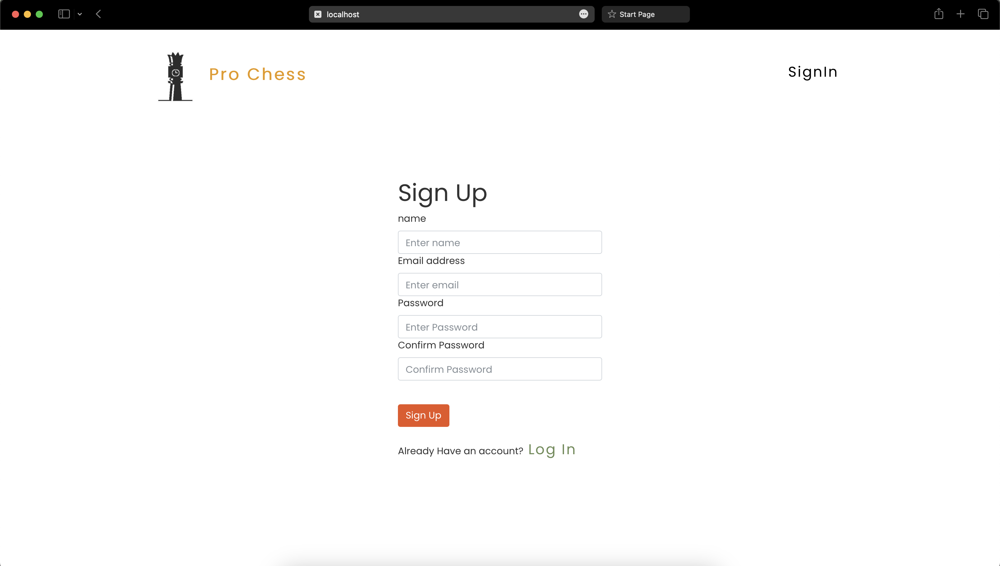
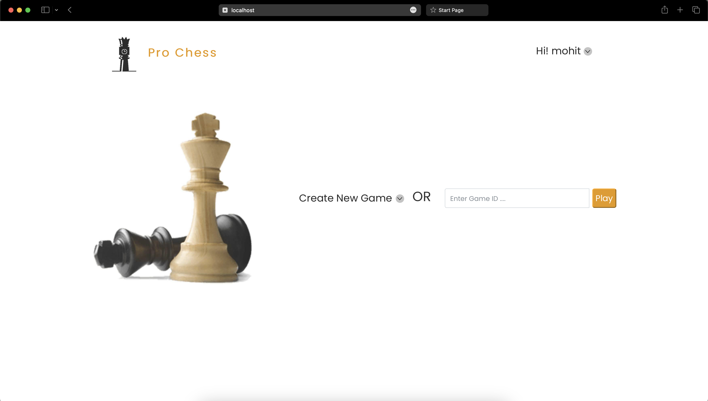
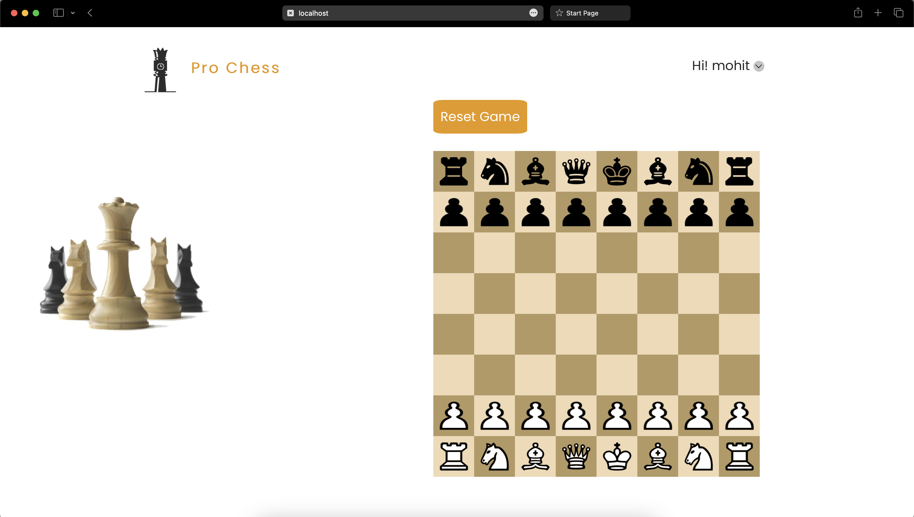
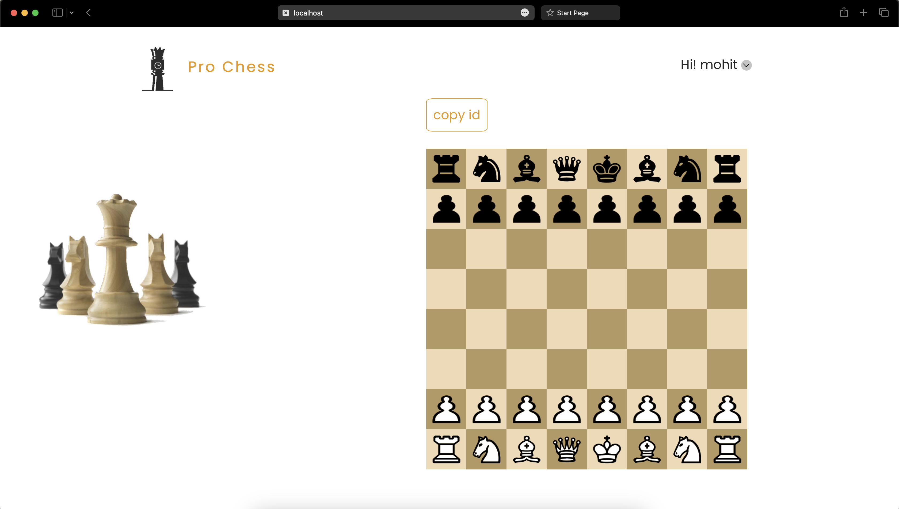

# ProChess

Welcome to ProChess, a dynamic chess platform that allows users to engage in thrilling chess matches both locally and online. With real-time gameplay, user-friendly interfaces, and seamless registration through our website, ProChess is the ultimate destination for chess enthusiasts.

# Screenshots:













## Features

- **Local and Online Gameplay:** Play chess locally with a friend or challenge others online for real-time matches.
  
- **User Registration:** Create an account on our website using JWT user authentication for a personalized chess experience.

- **Offline Game History:** All offline game history is stored locally, allowing you to review and analyze your past matches.

## Tech Stack

- **Frontend:** Built with ReactJS and hosted on Netlify, providing a smooth and responsive user interface.

- **Backend:** Powered by NodeJS and Express, with MongoDB as the database for efficient data storage.

- **Real-time Communication:** Integrated with socket.io to enable real-time communication and synchronization during online matches.

- **Authentication:** JWT (JSON Web Tokens) are used for secure user authentication, ensuring a safe and seamless login process.

- **Design:** Figma was utilized for the design process, ensuring a visually appealing and user-friendly interface.

## Getting Started

1. Clone the repository:

   ```bash
   git clone https://github.com/hellomohitsangwan/prochess.git

2. Install dependencies:
   ```bash
    cd prochess/client
    npm install
    cd ../serve
    npm install

3. Start the application:
   ```bash
    # Start frontend
    cd ../frontend
    npm start

    # Start backend
    cd ../backend
    npm start

4. Visit http://localhost:4848 to access the ProChess application.
5. Live link: 